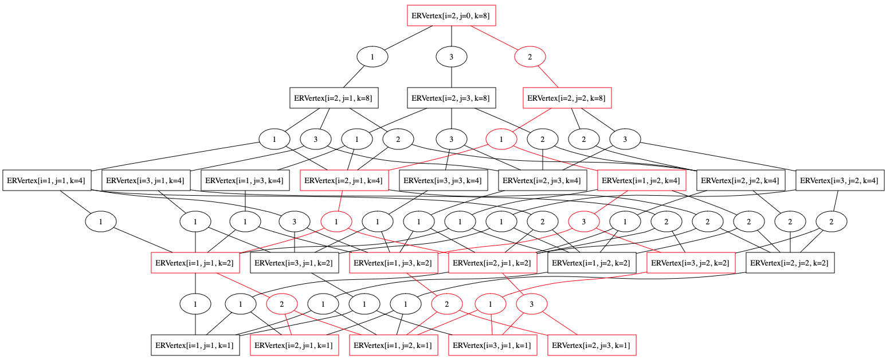

# DPGraphJ

#### DPGraphJ is written in Java

## Purpose

DPGraphJ is intended for teachers, students, scientists, or more generally anyone with minimal skills in Java programming who wish to systematically solve optimisation problems using dynamic programming.

## Requirements

Java $\geq$ 18

## Usage

DPGraphJ is a collection of reusable Java functions to solve optimization problems using a dynamic programming algorithm. It is based on a recursive schema that follows a top-down approach and uses the memoization technique. Such algorithm is a reusable software component that is generic and efficient and has been developed by paying special attention to good practices in the design of software. For using DPGraphJ, the problem to be solved needs to be modelled as an AND/OR graph. In the DPGraphJ_examples package, we provide 5 academic case studies.


## Project tree

- [DPGraphJ](DPGraphJ): project containing the reusable code for solving problems using Dynamic programming.
	- package [colors](DPGraphJ/src/colors): to format the visual representation of the AND/OR graphs and hypergraphs
 	- package [graphs](DPGraphJ/src/graphs): code for the implementation of the DP and DPR algorithms
 	- package [hypergraphs](DPGraphJ/src/hypergraphs): code for the implementation of the hypergraph data structures
 	- package [path](DPGraphJ/src/path): utility code for handling paths in graphs
 	- package [utils](DPGraphJ/src/path): code for handling data structures and basic types
-  [DPGraphJ_examples](DPGraphJ_examples): project containing 5 academic case studies:
	- [equipment_replacement](DPGraphJ_examples/src/equipment_replacement): problem to determine an optimal replacement policy for a single piece of equipment of age i over a time horizon of n units.
	- [equipment_replacement_all](DPGraphJ_examples/src/equipment_replacement_all): variant of the equipment replacement problem, except that in each unit of time, the possible decisions are to keep the part or replace it with another of any possible age, not necessarily new.
	- [floyd](DPGraphJ_examples/src/floyd): problem to calculate the shortest path connecting two vertices of a graph, considering that there are no negative weights.
	- [matrix_mult](DPGraphJ_examples/src/matrix_mult): problem to determine the optimal parenthesis of a product of n matrices.
	- [resources_allocation](DPGraphJ_examples/src/resources_allocation): problem to distribute x units of a resource among n activities, intending to maximize the return of that allocation, and subject to certain constraints.
 	- [files](DPGraphJ_examples/files) folder: contains both .txt files with different input data for the testing of the examples, and .gv files with the output in the form of hypergraphs and AND/OR graphs, in [GraphViz](http://www.webgraphviz.com) viewable format.

## Getting started with an example

For solving a Dynamic Programming problem, you have to implement some specific code. Let's go through the steps with the example of the [equipment replacement](DPGraphJ_examples/src/equipment_replacement), which is stated as follows: 

The problem seeks to determine an optimal replacement policy for a single piece of equipment of age *i* over a time horizon of *n* units. We assume:

- The part can have, at most, a life of *m* years after which it can no longer be in use.
- The annual maintenance cost is *c(i)*.
- The purchase price for a unit is *t(i)*. Where *t(0)* is the price of (buying) a new unit and *t(m)* is the residual (selling) price at the end of its operating life.
- The initial age is *e_0*.
- At each time unit, the possible decisions are *M*, *C* (keep, change) consisting of keeping the part at the current instant if possible or changing it for a new one.

To solve this problem by dynamic programming using DPGraphJ we must first implement the record that models the type of the solution, which is modelled as a string that contains integers concatenated by "->", where the integer in the i-th position represents the age of the equipment at the end of period i, that is, at the beginning of period i+1.

```java
public record SolStringDouble(String s, Double weight) {
	public static SolStringDouble of(String s, Double weight) {
		return new SolStringDouble(s, weight);
	}
}
```
Next we must implement the record for the vertex, which implements the HyperVertex interface. For this example, we model each vertex as 3 integers (i,j,k) representing the problem of finding the minimum cost when starting with a piece of age $i$, finishing with a piece of age $j$, and considering a time horizon of $k$ years. In the code, we must start implementing: 
- the initial problem (e_0,0,n), indicating that the final age of the equipment can be any age, and in all cases, the value of releasing the equipment at the end will be considered. This is the only problem with j=0.
- the of method for vertex creation
- the attributes

```java
public record EquipReplaceVertex(Integer i,Integer j,Integer k) 
		implements HyperVertex<EquipReplaceVertex,EquipReplaceEdge,Integer,SolStringDouble> {
	
	public static EquipReplaceVertex initial() {	
		return new EquipReplaceVertex(e0,0,N);
	}
	
	public static EquipReplaceVertex of(Integer i,Integer j,Integer k) {	
		return new EquipReplaceVertex(i,j,k);
	}

	public static int N; //number of periods
	public static int M; //maximum age
	public static int e0; //initial age
	public static List<Integer> operatingCost; //maintenance cost according to age
	public static List<Integer> tradeinCost; //cost to exchange for a new one according to age
	public static int priceNew; //price of new equipment
```

Then, the methods of the HyperVertex interface are implemented, although some of them do not require it because they have default implementations. 

Alternatives to reduce the current problem to problems of smaller size. For this example:
- k>1 -> [1,...,M]
- otherwise -> empty
```java
public List<Integer> alternatives() {
	if (k>1)
		return List2.rangeList(1, M+1);
	else 
		return List.of();
}
```

True if the current problem is a base case (i.e. vertex with no outgoing edges).
```java
public Boolean isBaseCase() {
	return  k == 1; 
}
```

Weight of the solution to the problem when this is a base case, being the weight the value for the objective function to be optimised. For this example:
- j==1 -> t(0) - t(i) + c(0)
- j==i+1 -> c(i)
```java
public Double baseCaseSolutionWeight() {
	Double r = null;
	if (j==1) {
		r = (double) (tradeinCost.get(0)-tradeinCost.get(i)+operatingCost.get(0));
	} else if (j==i+1) {
		r = (double) operatingCost.get(i);
	}
	return r;
}
```

Solution to the problem when it is a base case.
```java
public SolStringDouble baseCaseSolution() {
	Double weight = baseCaseSolutionWeight();
	String s=null;
	if (j==1) {
		s="1";
	} else if (j==i+1) {
		s=j.toString();
	}
	return SolStringDouble.of(s, weight);
}
```

List of subproblems (i.e. vertices) that are neighbors of the current problem when considering alternative a. For this example:
- j==0 -> [(i,a,k)]
- j>0 -> [(i,a,k/2),(a,j,k-k/2)]
```java
public List<EquipReplaceVertex> neighbors(Integer a) {
	List<EquipReplaceVertex> r=null;
	if (j==0) {
		r = List.of(this.neighbor(i, a, k));
	} else {
		r = List.of(this.neighbor(i, a, k/2), this.neighbor(a, j, k-k/2));
	}
	return r;
}
public EquipReplaceVertex neighbor(Integer i, Integer j, Integer k){
	return new EquipReplaceVertex(i,j,k);
}
```

Edge that originates from taking alternative a.
```java
public EquipReplaceEdge edge(Integer a) {
	return EquipReplaceEdge.of(this,this.neighbors(a), a);
}	
```

And finally, the edge should be implemented, following the modelling of the HyperEdge interface.
```java
public record EquipReplaceEdge(EquipReplaceVertex source,List<EquipReplaceVertex> targets,Integer alternative) implements HyperEdge<EquipReplaceVertex,EquipReplaceEdge,Integer,SolStringDouble>{
	
	public static EquipReplaceEdge of(EquipReplaceVertex source, List<EquipReplaceVertex> targets, Integer action) {
		return new EquipReplaceEdge(source, targets, action);
	}
  //weight associated with the solution of the problem that correspond to the source vertex, combining the weights of the solutions of the subproblems
	public Double solutionWeight(List<Double> solutions) {
		Double weight = null;
		if (source.j()==0) {
			weight = solutions.get(0) - EquipReplaceVertex.tradeinCost.get(this.alternative());
		} else {
			weight = solutions.get(0) + solutions.get(1);
		}
		return weight;
	}
  //solution to the problem by combining the solutions of the subproblems
	public SolStringDouble solution(List<SolStringDouble> solutions) {
		String r;
		Double weight;
		if (solutions.size()==1) {
			r = solutions.get(0).s();
		} else {
			r = String.format("%s -> %s",solutions.get(0).s(),solutions.get(1).s());	
		}
		if (source.j()==0) {
			weight = solutions.get(0).weight() - EquipReplaceVertex.tradeinCost.get(this.alternative());
		} else {
			weight = solutions.get(0).weight() + solutions.get(1).weight();
		}
	
		return SolStringDouble.of(r, weight);	
	}

	public String toString() {
		return this.alternative().toString();
	}
}
```

To test the implemented code, we run a main where the data is initialised, the initial vertex is created, and from it the solution to the problem is generated. This solution is stored in a GraphTree.

It is also possible to visualise the hypergraph and the AND/OR graph generated during the process of searching for the optimal solution by using the methods toDotHypergraph and toDotAndOr, respectively, which generate .gv files that can be visualised using GraphViz (even in its online tool http://www.webgraphviz.com).

```java
public class TestEquipReplace {
	public static void main(String[] args) {
		Locale.setDefault(new Locale("en", "US"));
		Auxiliar3.iniData("./files/equip_rep_DP/EqMant1.txt");
		EquipReplaceVertex p = EquipReplaceVertex.initial();
		SolStringDouble s = p.solution();
		System.out.println(s.weight().toString());
		System.out.println(s.s());
		GraphTree<EquipReplaceVertex, EquipReplaceEdge, Integer, SolStringDouble> t = p.graphTree();
		System.out.println(t.toString());
		System.out.println(t.string());
		
		SimpleDirectedGraph<Union<EquipReplaceVertex, EquipReplaceEdge>, DefaultEdge> g = p.data().graph();
		
		Data.toDotHypergraph(g, "files/equip_rep_DP/hiperEquipReplace1.gv", p);
		Data.toDotAndOr(g, "files/equip_rep_DP/andOrEquipReplace1.gv", p);
	}
}
```

As an example, the AND/OR graph that is generated for an example with the following input data is shown. On it the vertices and edges of the graphtree representing the optimal solution are drawn in red.
- n = 8
- m = 3
- e_0 = 2
- operating costs: 10, 27, 50
- trade-in costs: 120, 42, 27, 16
- price: 120



## Support

Authors: Irene Barba, Diana Borrego, Carmelo del Valle and Miguel Toro

Contact: dianabn@us.es
